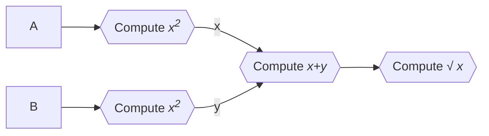
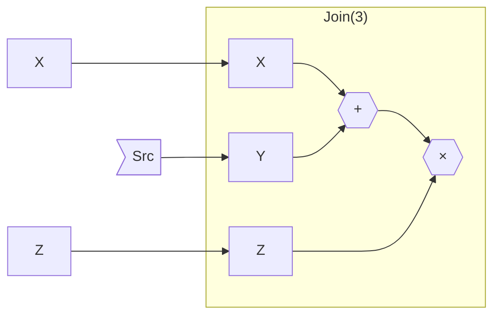
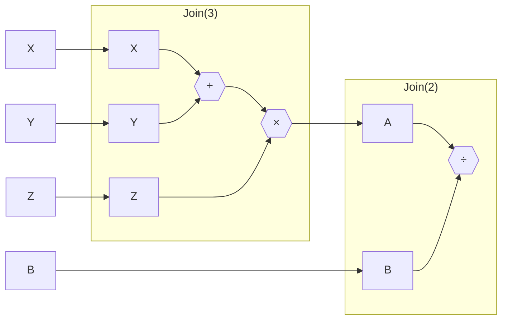
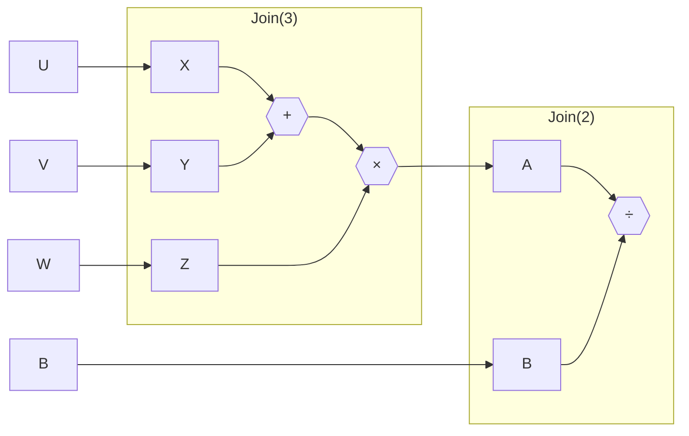
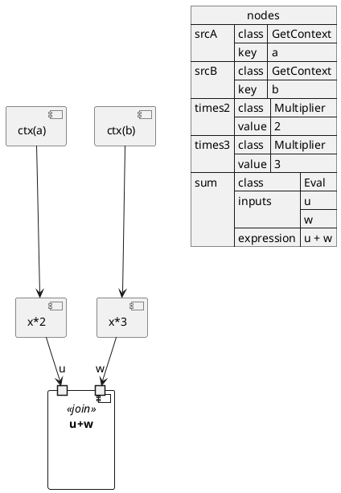

# Pythoid

A Python library that provides tools for building dataflows via function composition. It can be mapped to a variety of execution frameworks such as Apache Spark or Hadoop.

### Basic functional nodes

A dataflow can be thought of as a sequence of transformations applied to the source data items: those transformations can be simple 1:1 mappings like $x \rightarrow x^2$, or multi-argument operations like $x,y,z \rightarrow (x+y) \times z$; source values can be generated by the dataflow itself (e.g. loaded from a database) or supplied as arguments when the dataflow is launched. Finally, the output values computed by the dataflow can be returned to the calling process, or materialized elsewhere (e.g. written to an external file), in which case the return value is going to be some sort of handle to the external resource (see *Sink* below).

We can therefore view dataflow as an acyclic graph; for example, this dataflow computes the hypotenuse of a right triangle $c=\sqrt{a^2+b^2}$:



The basic building blocks of this library are called nodes; they represent generalized functions that operate on arguments of some type $T$, which can be numbers or strings or booleans or specialized structures like Apache Spark `DataFrame` or `RDD`. Additionally, those functions take the execution context as of their parameters.  Execution context can be anything that makes sense for the chosen computational framework (or can even be `None`) – e.g. a `SparkSession` or `StreamingContext`. Hereinafter it is designated by letter $C$.

The Pythoid type system recognizes the following node types:

- **Source**: An abstraction over a function that takes execution context as the argument and returns an instance of type $T$: $f(C) \rightarrow T$. This is a "producer" node, which generates values – e.g. reading data from a file or external database. It may – but does not have to – utilize the execution context passed to it.
- **Transformer**: An abstraction over a function that takes the execution context and an input value of type $T$ and returns an instance of type $T$: $f(C, T) \rightarrow T$.
- **Join(n)**: An abstraction over a function with multiple arguments: the execution context followed by one or more named input values of type $T$, which returns an instance of type $T$:  $f(C, T^n) \rightarrow T$. Note that in Pythoid a Join node must explicitly declare the number of arguments ("rank" denoted as $n$ above) it expects, along with their names.
- **Sink**: An abstraction over a function that produces some *side effects* (unlike pure functions *Source*, *Transformer*, or *Join* that are assumed side effect free). The return value can be some sort of handle that would allow the user to further access those side effects; it can be nothing, or a file descriptor, or Spark `StreamingQuery` reference etc. Depending on the number of input arguments, Sink is further subclassed into three types:
  - **S-Sink** (a.k.a. **Task**): A function that takes no arguments of type $T$ and produces nothing but generates side effects: $f(C) \rightarrow \epsilon$
  - **T-Sink** (a.k.a. **Stub**): A function that takes one argument of type $T$ and produces nothing but side effects: $f(C,T) \rightarrow \epsilon$
  - **J-Sink(n)** (a.k.a. **Module**): A function that takes multiple arguments and produces only side effects: $f(C,T^n) \rightarrow \epsilon$

### Node composition

Nodes are functions so they can be naturally composed. For example, we could build a chain of transformers $tx_1,tx_2, \cdots ,tx_n$ so that the output of one transformer is used as the input for the next one: $T_1 \rightarrow T_2 \rightarrow \cdots \rightarrow T_n$. Mathematically this is equivalent to a transformer function $f(C, T) \rightarrow T$ which expands to $tx_n(C, \cdots tx_3(C,tx_2(C,tx_1(C,T))) \cdots )$. In other words, composing a transformer with another transformer yields a transformer. For example, combining transformer defined as $\lambda1 : x \rightarrow x^2$ with transformer $\lambda2 : x \rightarrow \sin x$ produces a transformer equivalent of a function $\lambda : x \rightarrow \sin x^2$.

Now suppose we have a Join(3) node that computes $x,y,z \rightarrow (x + y) \times z$ and a Source node that produces a numerical value. We can compose them by connecting, for example, the output of Source node to the input labeled $y$ of our Join(3) node. This yields a Join(2) node with only two inputs now: $x$ and $z$ (input $y$ is fed from our Source node and not exposed anymore). The figure below illustrates this:



Finally, let's look at the composition of two Join nodes. This is where things become interesting. Suppose we have a Join(3) node from example above that computes $x,y,z \rightarrow (x + y) \times z$ and a Join(2) that computes $a,b \rightarrow {a \div b}$. We want to connect them in such a way that the output of Join(3) node is connected to input $a$ of Join(2) node. The result is a Join(4) node with inputs $X,Y,Z,B$ that will look as follows:



> Since it is up to the creator of each node to choose labels for their inputs, it is quite possible that combining two nodes will result in a name conflict: for example, if the inputs of Join(2)  above were labeled as $x,y$ instead of $a,b$, this would cause label $y$ appear twice in the input list of the resulting Join(4) node. To avoid this, Pythoid allows *relabeling* the inputs while connecting the nodes – so the example above could look like this:



We can summarize possible compositions in the table below. Each cell shows the resulting node type.
| $\downarrow$ connects to $\rightarrow$ | Transformer | Join(n) | T-Sink | J-Sink(n) |
|-|-|-|-|-|
|**Source**|Source|Join(n-1)|S-Sink|J-Sink(n-1)|
|**Transformer**|Transformer|Join(n)|T-Sink|J-Sink(n)|
|**Join(m)**|Join(m)|Join(m+n-1)|J-Sink(m)|J-Sink(m+n-1)|

...or alternatively in a functional form.
| $\downarrow$ connects to $\rightarrow$ | $f(C,T) \rightarrow T$ | $f(C, T^n) \rightarrow T$ | $f(C,T) \rightarrow \epsilon$ | $f(C,T^n) \rightarrow \epsilon$ |
|-|-|-|-|-|
| $f(C) \rightarrow T$ | $f(C) \rightarrow T$ | $f(C,T^{n-1}) \rightarrow T$ | $f(C) \rightarrow \epsilon$ | $f(C,T^{n-1}) \rightarrow \epsilon$ |
| $f(C, T) \rightarrow T$ | $f(C, T) \rightarrow T$ | $f(C,T^n) \rightarrow T$ | $f(C,T) \rightarrow \epsilon$ | $f(C,T^n) \rightarrow \epsilon$ |
| $f(C, T^m) \rightarrow T$ | $f(C,T^m) \rightarrow T$ | $f(C,T^{m+n-1}) \rightarrow T$ | $f(C,T^m) \rightarrow \epsilon$ | $f(C,T^{m+n-1}) \rightarrow \epsilon$ |

As one can see, a Source composed with a Transformer yields a source, while a Join connected to an input of another Join constitutes a synthetic join with the combined inputs of the two joins; Transformer connected to another node does not change the shape of the resulting node, and so on...

### Functional Syntax

First creating nodes...
```python
src1 = FileReader(path="people.csv", format="csv", header=True)
tx1 = FieldFilter("age > 18")
src2 = FileReader(path="scores.csv", format="csv", header=True)
tx2 = FieldFilter("subject == 'math'")
merge = RecordJoin("a.person == b.person")
```
... then connecting them using composition methods:
```python
pipe1 = src1.to_transformer(tx1)
pipe2 = src2.to_transformer(tx2)
pipeline = pipe2.to_join(pipe1.to_join(merge, "a"), "b")
```
... or using their operator form:
```python
pipe1 = src1 >> tx1
pipe2 = src2 >> tx2
pipeline = pipe2 >= ((pipe1 >= (merge, "a")), "b")
```

The following methods and operator equivalents are provided for composing the nodes:

|Description|Method|Operator|
|-|-|-|
|Connects this node's output to the input of a Transformer|to_transformer|>>|
|Connects this node's output to an input of a Join|to_join|>=|
|Connects this node's output to the input of a Stub|to_stub|>|
|Connects this node's output to an input of a Module|to_module|\||

The result of the node composition is, a function extending one of the basic node types. It can be invoked using the standard function calling syntax:

```python
pipeline1 = src1 >> tx1 >> tx2  # pipeline1 is a Source
result1 = pipeline1(context)

pipeline2 = tx1 >> tx2  # pipeline2 is a Transformer
result2 = pipeline2(context, 5)

pipeline3 = join1 >> tx1 >> stub  # pipeline3 is a Module
pipeline3(context, a=1, b=2, ...)
```

### Builder Syntax

Composing a large number of nodes together may become messy and hard to read. Alternatively, one can use builder syntax to chain nodes togeter:

```python
builder = FlowBuilder()
builder.connect(src1).to(tx1)
builder.connect(src2).to(tx2)
builder.connect(tx1).to(merge).as_input("a")
builder.connect(tx2).to(merge).as_input("b").rename_input("c")
pipeline = builder.build()
```

### PlantUML

Pythod supports both importing from and exporting to PlantUML.

#### Import

You can import a PlantUML file as a Pythoid flow. It can follow a standard [Component Diagram](https://plantuml.com/component-diagram) syntax. All theme settings, skin parameters, decorations etc are ignored. The only requirements are:
1. When connecting a node to an input of a Merge or Module, the `name_input` syntax must be used. So `X --> Y_a` means "connect the output of node **X** to input **a** of node **Y**."
2. The file must have a JSON section called "nodes" where all nodes are defined. The key of each entry inside the JSON is the alias used for the node (hence they should match the ones used in the connections), and the value is a JSON object with at least one key - "class", which is the Python class for this node. The rest of the elements must match the constructor parameters for this class.

Here is an example. Let's say you implemented a few custom node classes in your project (you can also use ones from the Pythoid standard library) in a file "**custom_nodes.py**":

```python
IntCtx = Dict[str, int]

class GetContext(SimpleSource[IntCtx, int]):
    def __init__(self, *, key: str):
        self.key = key
        super().__init__(lambda ctx: ctx[key])

class Multiplier(SimpleTransformer[IntCtx, int]):
    def __init__(self, *, value: int):
        self.value = value
        super().__init__(lambda _, x: x * value)

class Eval(SimpleJoin[IntCtx, int]):
    def __init__(self, *, inputs: List[str], expression: str):
        self.expression = expression
        super().__init__(set(inputs), lambda _, **kw: eval(expression, kw))
```

Then we composed a sample PlantUML file "**flow.puml**":


As you see, we create a few nodes (two Sources, two Transformers and one Join) and connect them as usual. *Again, keep in mind that PlantUML flow builder only analyzes the connections and `json nodes` sections, it ignores everything else. So those `component` definitions are simply to be able to render this file by PlantUML, if needed.*

Now we can import the flow definition and run the flow:

```python
builder = PlantumlFlowBuilder.from_file("flow.puml")
builder.add_module("custom_nodes")
flow = builder.build_flow()
context = {"a": 4, "b": 3}
result = flow(context, w=5)
```

To be continued.
